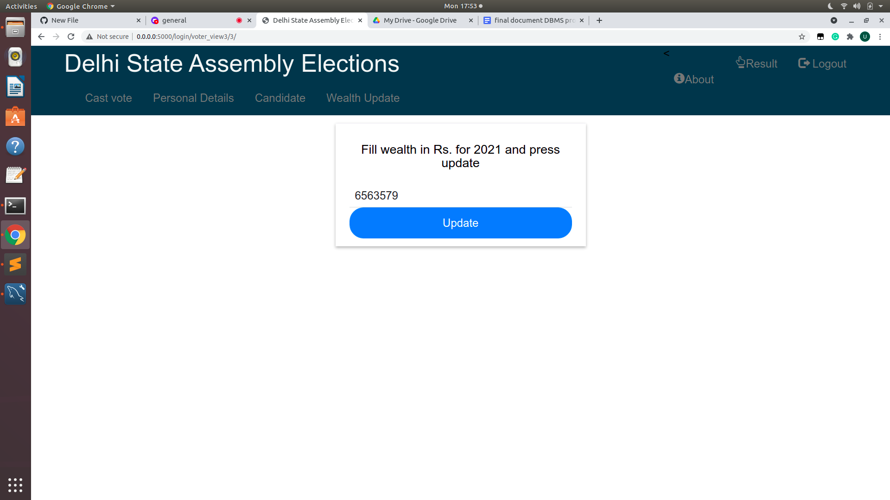

<h1> Web Portal </h1>

<h2>Home page</h2>

<h2>Results page</h2>

<h2>Registration page</h2>

<h2>Login page</h2>

<h2>Candidate Registration page</h2>

<h2>Biodata update page</h2>

<h2>Info update page</h2>

<h2>Vote Casting page</h2>

